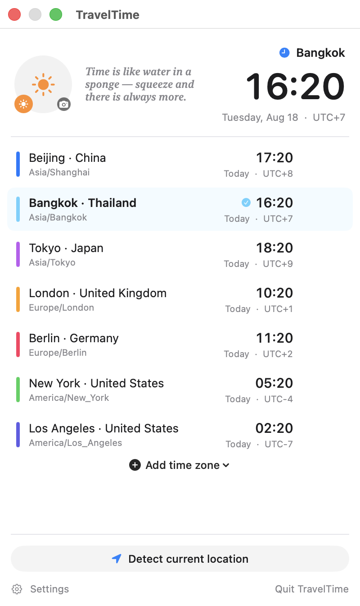
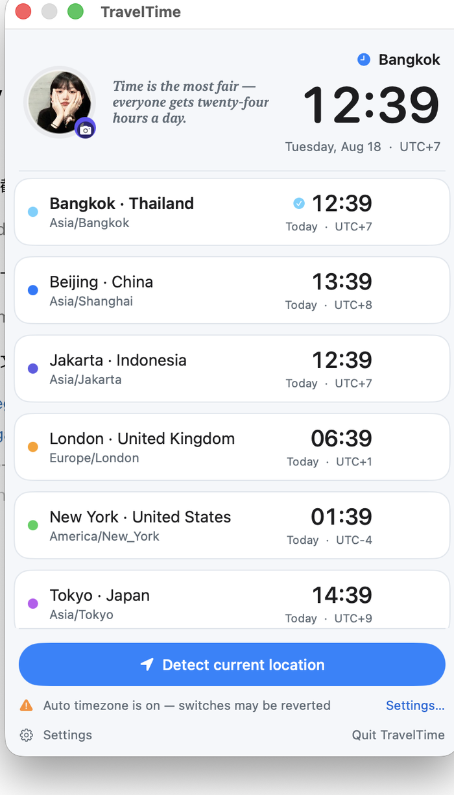
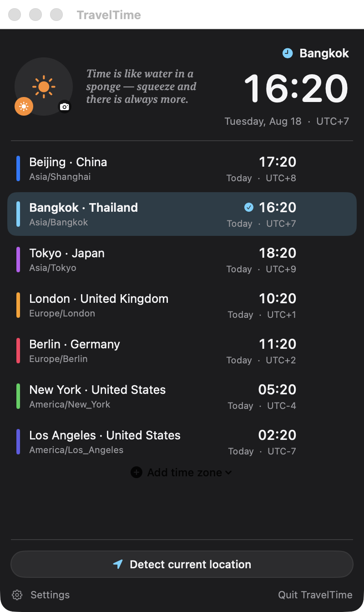
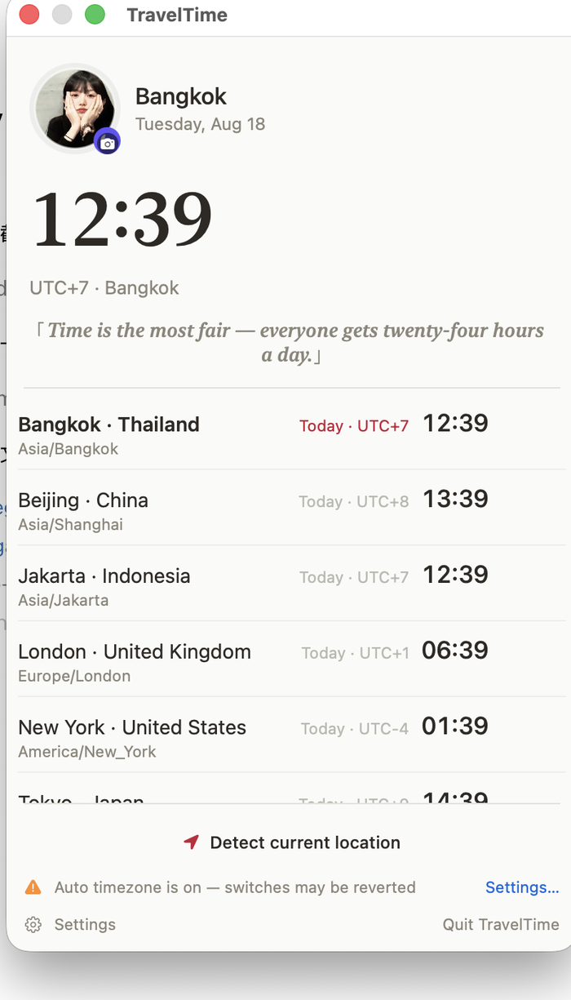

# TravelTime


A lightweight macOS menu bar app for tracking multiple time zones and switching your system time zone in one click.


## Four built-in themes

Pick the look that suits your desktop. Switch at any time from **Settings → Appearance**.

| Minimal · clean flat | Glass · card-based |
|---|---|
|  |  |

| Midnight · dark immersive | Editorial · serif + quotes |
|---|---|
|  |  |

## Features

- **Multi-zone clock** — See your local time in the menu bar, and multiple zones at a glance in the panel. Each row shows today / yesterday / tomorrow relative to your system time zone.
- **Day/night indicator** — A sun or moon icon next to every zone tells you instantly whether it's daytime or the middle of the night over there.
- **DST badge** — Zones currently observing daylight saving time are tagged so offsets never surprise you.
- **One-click time zone switching** — Click any zone to switch your entire Mac to it (requires administrator authorization).
- **Manage zones in place** — Hover any zone to swap, replace, or delete it. Click "Add time zone" at the bottom to pick from 25 common cities. The window height adapts automatically.
- **Custom avatar** — Click your avatar to pick any image from disk. Stored in `~/Library/Application Support/TravelTime/`.
- **Automatic location detection** — Detects your current city and time zone via IP geolocation, then switches with one click.
- **Conflict warning** — If macOS "Set time zone automatically" is enabled, the panel warns you and links straight to System Settings, so your manual switch doesn't get reverted. The warning disappears automatically within 30 seconds of toggling the system setting off.
- **Built-in updater** — Check for updates and upgrade in place from the settings window.

## Requirements

- macOS 14.0 (Sonoma) or later
- Xcode Command Line Tools (for building from source)

## Install

Download the latest `TravelTime.app.zip` from [Releases](https://github.com/susunola/TravelTime/releases), unzip it, and drag `TravelTime.app` into `/Applications`.

The app is ad-hoc signed and not notarized, so the first launch needs a right-click → **Open** to get past Gatekeeper.

### Build from source

```bash
git clone https://github.com/susunola/TravelTime.git
cd TravelTime
python3 make_icon.py Resources   # generate AppIcon.icns (standard library only)
./build.sh                       # build, assemble the .app, sign, deploy
```

The build script automatically deploys to `/Applications/TravelTime.app` and cleans up local build artifacts so Launchpad never shows duplicates. `dist/` is kept empty on purpose.

## Usage

| Action | Result |
|---|---|
| Click the TravelTime icon in the Dock | Open the time zone panel |
| Click any zone row | Switch the system time zone (prompts for administrator authorization) |
| Hover a zone → ⤺ button | Replace this zone with another city |
| Hover a zone → ✕ button | Delete this zone from your list |
| Bottom of panel → "Add time zone ⌄" | Pick from 25 common cities |
| "Detect current location" | IP geolocation → preview → switch |
| Avatar (top-left) | Click to choose a custom image |
| Settings → Appearance | Switch between Minimal / Glass / Midnight / Editorial |
| Settings → "Software Update" | Check for and install a new version in place |
| Settings → "Uninstall TravelTime" | Remove the app and all local data |
| Panel → "Quit TravelTime" | Quit (there is no Dock icon, so quit from here) |

## FAQ

**No icon in the menu bar on macOS 26?**
Enable it under System Settings › Siri & Spotlight › Spotlight Privacy (or skip — TravelTime is a regular Dock app, just click the Dock icon).

**Why does every switch ask for a password?**
Changing the system time zone requires administrator privileges on macOS. The app uses the standard system authorization dialog and never stores your password. Cancelling the prompt silently does nothing — no error message.

**My switch got reverted.**
System Settings › General › Date & Time › "Set time zone automatically" overrides manual changes based on your location. The app detects this and shows a warning that links directly to the system setting; turn off automatic and the warning vanishes within 30 seconds.

**I see two TravelTime icons in Launchpad.**
That happens when the release zip is sitting in `~/Downloads/` — Launchpad reads the bundle metadata inside the zip and treats it as a separate entry. Rename the zip to `TravelTime-vX.X.X.app.zip.bak` (drop the `.zip` suffix) and `killall Dock`.

**Location detection is inaccurate.**
Free IP geolocation is city-level at best. It's fine for travel, but pick the zone manually when precision matters.

**Leftovers after uninstalling?**
Launchpad caches its icon list, so run `killall Dock` (or log out and back in) to refresh it. That's a macOS behavior, not app residue.

## Technical notes

- AppKit `NSStatusItem` (best-effort on macOS 26) + SwiftUI-rendered `NSWindow` panel. No third-party dependencies.
- Time zone switching runs `/usr/sbin/systemsetup -settimezone` through an `osascript` subprocess with administrator privileges, off the main thread so the UI stays responsive during authorization.
- Auto-timezone detection watches three signals: `NSSystemTimeZoneDidChange` notification, a 30-second poll of the system plist, and an on-appear refresh when the panel opens.
- IP geolocation tries ip-api.com first and falls back to ipapi.co.
- Updates come from GitHub Releases and are verified against the SHA256 published in the release notes before installation.
- The app icon is generated by `make_icon.py` using only the Python standard library.

## License

MIT